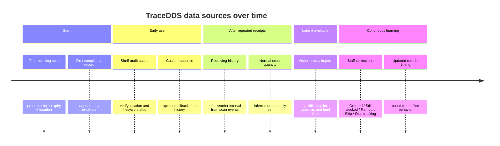

# TraceDDS scanner-first product report for Patrice

## Executive summary

TraceDDS should be designed as a **scanner-first, compliance-first dental supply system** whose core promise is evidentiary traceability, not exact on-hand inventory. In practice, scanning is the best way to capture and prove **what product was seen, which lot or serial it belongs to, when it expires, where it was located, when it was captured, and by whom**. That maps directly to how FDA-regulated recalls and device identification work: FDA’s UDI framework treats **lot/batch, serial number, and expiration date** as production identifiers when they appear on device labels, and FDA recall communications routinely require affected users to **identify, segregate, quarantine, or remove specific affected lots/devices**. FDA’s drug-recall guidance similarly tells users to **check the lot number on the label** to determine whether a drug is affected. citeturn18view0turn25view0turn18view1

That asymmetry matters. A scan can usually tell TraceDDS **expiration** and **location evidence**, but it usually cannot tell TraceDDS **how much remains** after use. This means the default product model should be an **append-only compliance evidence record**, while **quantity** should be treated as an **estimate** used for reorder timing only. The product should therefore avoid promising exact counts, avoid confidence scores, and avoid forcing offices into per-use logging. This recommendation also fits the most relevant federal recordkeeping model for the hardest category—controlled substances. DEA requires inventories and transaction records for controlled substances, but also explicitly says registrants are **not required to maintain a perpetual inventory**. citeturn22view0turn24view0turn23view0

The recommended V1 architecture is therefore:  
**default model = lot/location/expiration evidence**;  
**reorder = lightweight timing estimate** driven first by receiving scans, then by staff corrections, with optional supplier-history backfill;  
**exceptions = unit-level records for serialized items and a separate ledger for controlled substances**. This structure also aligns well with OSHA’s Hazard Communication Standard, which requires employers to keep **safety data sheets readily accessible** for hazardous chemicals and to maintain availability of the written hazard communication program and hazardous-chemical lists, and with CDC dental guidance, which expects sterilized packages to be labeled with items such as **cycle/load, sterilization date, and expiration date if applicable** to support retrieval after a sterilization failure. citeturn18view3turn18view4

The highest-leverage V1 product decision is to make the scan flow explicitly split into **Receiving** and **Shelf Audit**. Receiving scans should create the compliance record **and** seed reorder history. Shelf-audit scans should only verify presence, location, and status. That keeps scanning fast, reduces double entry, and avoids asking the office to provide both invoice history and manual usage estimates up front. For offices that do have consolidated supplier history, import should be an accelerator rather than a prerequisite; Henry Schein, for example, visibly exposes **“Order from History”** in its dental supplies interface, which suggests import can shorten time-to-value for a meaningful subset of practices. citeturn27search0

**Bottom line:** TraceDDS should sell and execute on three things in V1:  
**proof of lot/expiry/location**, **expiration/recall resolution workflows**, and **simple reorder prompts without false precision**. The UI should surface **basis** and **next action**, not algorithms or confidence percentages.

| Decision | Recommendation | Why it wins |
|---|---|---|
| Default record model | Append-only compliance evidence by lot and location | Scanning yields evidence; it does not yield true depletion |
| Quantity | Estimated only | Prevents overclaiming and avoids perpetual-inventory burden |
| Reorder UX | Simple timing + status tags | Users need action prompts, not probabilities |
| Exceptions | Serialized = unit-level; controlled substances = separate ledger | Matches FDA identifier logic and DEA recordkeeping structure |

## Product model and data architecture

The right default data model is **one record per lot per location**, not one record per package. Quantity should not split a lot into multiple compliance records; location can. If the same lot is in the sterilization room and a hygiene cabinet, that should appear as two location records under the same lot. The record should be **append-only** so the office preserves a “last known good” audit trail rather than silently overwriting history. This is especially defensible for recall response and for any office that later has to prove where a product was last seen. FDA’s device-identification model is built around label-level identifiers such as lot, serial, and expiration, and CDC’s sterilization guidance emphasizes labeling and retrieval traceability. citeturn18view0turn18view4

A good mental model is to split TraceDDS into two layers. The first layer is **compliance evidence**. The second is **operational estimation**. Compliance evidence should store what is known from a scan or human confirmation. Operational estimation should store what is inferred about reorder timing, depletion, and review cadence. This keeps the regulatory story clean and the UX honest.

### Field-definition table

| Field | Example | Type | Why it exists |
|---|---|---|---|
| Product | CaviWipes 160 | Evidence | Human-readable product identity |
| Lot / batch number | A219 | Evidence | Primary recall and expiration lookup key |
| Serial number | SN-0045821 | Evidence | Unit identity when the item is serialized |
| Expiration date | 2027-04 | Evidence | High-value compliance attribute |
| Location | Hygiene Cabinet | Evidence | Last known physical location |
| Capture date | 2026-06-23 | Evidence | Audit trail and freshness |
| Capture source | Receiving scan / Shelf audit / Manual correction | Evidence | Distinguishes receipt from verification |
| User | Ashley R. | Evidence | Accountability and inspection trail |
| Lifecycle status | Present / Expired unresolved / Recalled unresolved / Confirmed disposed / Not found / Capture error | Evidence | Current known state of the record |
| Opened date | 2026-06-01 | Evidence when entered | Needed for some vials, liquids, and volume-based products |
| Supplier | Henry Schein | Operational metadata | Helps reorder routing |
| Normal order quantity | 2 cases | Operational metadata | Useful for reorder suggestions |
| Reorder basis | From receiving history / Custom cadence / Opened-date estimate / Verification schedule | Operational metadata | Tells the user where the suggestion came from |
| Reorder status tag | On cadence / Due soon / Reorder due / Verify stock / Stale / Verified | Operational output | Simple user-facing action cue |
| Quantity remaining | Unknown / Estimated | Estimate | Should not be asserted as exact unless maintained manually |

The key design rule is straightforward: **quantity is estimated; lot status is evidence-based**. That distinction should appear throughout product copy and behavior.

Two exceptions deserve special handling. First, **serialized items** should be tracked at the unit level because the serial number makes each unit distinct; FDA explicitly recognizes serial number as a production identifier in the UDI system. Second, **controlled substances** should be managed in a separate ledger module because DEA imposes specific inventory, retention, segregation, and loss-reporting requirements that are materially different from ordinary dental supplies. DEA requires current and accurate records of controlled-substance receipts and dispositions, initial and biennial inventories, two-year retention, and prompt theft/loss reporting, while not requiring a perpetual inventory. citeturn18view0turn22view0turn24view0turn23view0turn12view0turn13view1turn13view2

## Reorder logic and user experience

For **scanner-first V1**, the reorder stack should prioritize the signals TraceDDS can create itself. Optional order-history import remains valuable, but the app should not depend on invoices or consolidated suppliers to be useful.

### Ranked reorder methods for scanner-first V1

| Rank | Method | When to use it | UI role | Visible to user |
|---:|---|---|---|---|
| 1 | **Receiving history** | After 2–3 receiving events for the same product | Primary reorder engine | Yes |
| 2 | **Custom cadence** | No usable history yet, or office wants direct control | Universal fallback | Yes |
| 3 | **Staff correction loop** | Every reorder prompt | Tuning mechanism, not a setup mode | Yes, as actions |
| 4 | **Opened-date estimate** | Vials, liquids, tubs, medicaments, bonding agents, etc. | Category-specific modifier | Yes, only when relevant |
| 5 | **Verification schedule** | Emergency drugs, compliance-sensitive items, presence-critical stock | Separate from reorder math | Yes |
| 6 | **Order history import** | Supplier or invoice history is available | Accelerator and backfill | Yes, when connected |
| 7 | **Office profile starter estimate** | New office with no history | Onboarding fallback | Lightly |
| 8 | **Category formula** | Predictable disposable categories only | Advanced assumption layer | Mostly hidden |

This ranking is intentionally different from a general inventory product. In a traditional purchasing tool, import might rank first. In TraceDDS, **scanner-first means self-generated evidence comes first**. Optional supplier import should enrich the model later, not define V1. That said, some suppliers already expose prior-order workflows. Henry Schein’s dental supplies experience explicitly advertises **“Order from History,”** so for offices that buy heavily from one supplier, import can materially shorten the time required to build reorder patterns. citeturn27search0

The **visible user-facing basis labels** should be simple and operational:

- **From receiving history**
- **Custom cadence**
- **Opened-date estimate**
- **Verification schedule**
- **From order history** (only if connected)
- **Starter estimate** (onboarding only, lightly presented)

The **user-facing output** should be a timing statement or task, not an exact count. Good examples are:

- “Likely reorder in 3 weeks.”
- “Reorder due.”
- “Verify stock.”
- “Opened 24 days ago; review in 2 weeks.”
- “Expires in 30 days; replace or confirm removal.”

The UI should **not** show confidence scores, probability percentages, exact quantity claims, or “AI confidence” language. Those patterns ask the office to underwrite model uncertainty instead of helping them make a decision.

### What should not be in the V1 UI

| Avoid | Reason |
|---|---|
| Confidence percentages | Sounds like model internals, not office operations |
| Exact on-hand counts by default | The system usually does not know depletion |
| Required per-product usage formulas in the scan flow | Too much setup burden |
| Per-use logging | Kills adoption for dental supplies |
| Auto-disappearing lots | Destroys auditability |
| One giant “inventory mode” | Conflates compliance evidence with purchasing estimates |

## Scanner workflows and onboarding

The scan flow should branch immediately into **Receiving** and **Shelf Audit**. That distinction is the operational backbone of a scanner-first product.

### Receiving vs shelf-audit workflow

| Workflow | Primary goal | Minimum fields | Optional fields | Output | Reorder effect |
|---|---|---|---|---|---|
| **Receiving** | Create new compliance evidence at the moment product enters the office | Product match, lot, expiration, received date auto, user auto, capture source auto, initial location | Quantity received, supplier, PO/invoice ref, normal order quantity | New lot/location evidence record + receipt event | Seeds reorder history |
| **Shelf Audit** | Verify what is on the shelf right now | Product match, lot if visible, expiration if visible, location, status, scan date auto, user auto | Move reason, issue flag, notes | Presence/absence/location evidence update | Refreshes “verified/stale” status only |

Receiving is the only scan flow where **shipment context** and **label context** coexist. That makes it the best place to capture lot and expiration **and** create the future cadence signal. By contrast, a shelf-audit scan should never be mistaken for a purchase event. It should prove that an item was present, moved, missing, expired, or otherwise unresolved.

This also resolves the invoice problem. If an office has clean order history, great—import it. If it does not, **receiving scans become the history** over time. That means the product can start useful on day one without requiring backfilled purchasing records.

### Onboarding options

**Office profile starter estimate.**  
At setup, ask for low-burden office facts: operatories, providers, hygienists, patients per month, open days per week, and broad procedure mix. Use these only to generate a rough starter schedule for obvious disposables. This should be clearly labeled **Starter estimate**, not represented as measured reality.

**Category formula mode.**  
Keep this mostly hidden. It is appropriate for predictable consumables such as trays, bibs, barriers, sterilization pouches, prophy angles, cups, and similar items with a relatively direct relationship to patient volume. It is not a good fit for variable products such as bonding agents, impression materials, graft materials, burs, implant components, emergency meds, or waterline products.

**Manual cadence.**  
This should be the universal fallback. If the office knows it typically reorders a product monthly or every 60 days, let them set that in one tap. This is much lower burden than asking the office to estimate usage per patient for every SKU.

**Opened-date mode.**  
Use this when the product is a vial, liquid, or other volume-based item whose remaining quantity cannot be inferred from a scan. CDC’s 2024 dental guidance is especially relevant here: in dental settings, **multidose vials should be dated when first opened and discarded within 28 days unless the manufacturer specifies otherwise**. That is a strong official precedent for an opened-date workflow. citeturn21view0

## V1 behavior, staff correction loop, and compliance mapping

Every reorder prompt should allow a few lightweight actions so the office can correct the system without counting inventory. The recommended actions are:

- **Ordered**
- **Still stocked**
- **Ran out**
- **Skip**
- **Change cadence**
- **Stop tracking**

These actions should tune the next reminder. If the office repeatedly taps **Still stocked**, push the cadence later. If it taps **Ran out**, shorten it. If the office stops using the item, stop reminding without deleting the historical evidence.

### Recommended user-facing tags

| Tag | Meaning | Typical trigger |
|---|---|---|
| **Verified** | Recently confirmed present | Recent receiving or shelf-audit scan |
| **On cadence** | No action needed yet | Reorder window not near |
| **Due soon** | Approaching expected reorder window | Timing threshold reached |
| **Reorder due** | Action likely needed now | Past expected reorder point |
| **Verify stock** | Signal exists, but human check needed | Sparse history or conflicting corrections |
| **Stale** | Record not recently verified | No recent scan or confirm action |

### Compliance mapping

The federal baseline is clear enough to shape the product even before state rules are layered in. State priorities were **not specified**, so the table below uses federal requirements first and adds **California and Texas only as illustrative state-board overlays**.

| Compliance area | Official requirement or guidance | Product implication |
|---|---|---|
| **FDA device identification** | FDA UDI guidance says the production identifier may include **lot/batch**, **serial number**, and **expiration date** when those appear on the label. citeturn18view0 | Default scan capture should store lot, serial, and expiration as first-class fields. |
| **FDA device recalls** | FDA device recall communications frequently instruct users to **identify, segregate, and quarantine** affected product and affected lots in inventory. citeturn25view0 | Recall handling should be lot-centric and task-oriented; recalled items should remain unresolved until removed or confirmed. |
| **FDA drug recalls** | FDA instructs users to **check the lot number on the label** to determine whether a recalled drug is affected and publishes recall classification/reason data. citeturn18view1 | Drug recall matching should be lot-based, not product-name-only. |
| **CDC dental sterilization** | CDC says sterilized packages should be labeled with the **sterilizer used, cycle/load number, sterilization date, and expiration date if applicable** because that helps retrieve processed items after a sterilization failure. citeturn18view4turn13view0 | Keep append-only evidence and retrieval history for sterilized items and packs. |
| **CDC safe injection in dental settings** | CDC says multidose vials in dental settings should be **dated when first opened** and discarded within **28 days** unless the manufacturer specifies otherwise. citeturn21view0 | Add opened-date tracking for relevant drugs and vials. |
| **OSHA Hazard Communication** | OSHA requires employers to keep **SDSs for each hazardous chemical readily accessible**, and employees must know the location and availability of the written hazard communication program, required hazardous-chemical lists, and SDSs. Electronic SDS access is allowed if it creates no barrier to immediate access. citeturn18view3 | Link products to SDSs and hazard lists; support immediate digital access. |
| **OSHA dental-device interpretation** | OSHA has specifically stated that some dental devices require MSDS/SDS treatment if they are not exempt under the article or consumer-product provisions of the Hazard Communication Standard. citeturn26view0 | Do not assume all dental products are outside HazCom; support SDS linkage for covered products. |
| **DEA controlled substances** | DEA requires current and accurate controlled-substance records, initial inventory, biennial inventory, two-year retention, and separate or readily retrievable records by schedule class; DEA also states **no registrant shall be required to maintain a perpetual inventory**. citeturn22view0turn24view0turn12view0turn13view1 | Use a separate controlled-substance ledger, not the default general-supply model. |
| **DEA theft/loss reporting** | Practitioners must notify DEA of theft or significant loss within **one business day** and file **DEA Form 106** within **45 days**. citeturn23view0turn13view2 | Controlled-substance workflow should support urgent exception flags and record packaging for Form 106 events. |
| **Texas board example** | TSBDE sedation guidance highlights written emergency-preparedness policies plus **staff training log, emergency drug log, and equipment readiness log** for affected permit holders. citeturn18view6turn29view0 | State overlays should allow office/permit-specific emergency-drug and equipment checks. |
| **California board example** | California’s moderate-sedation application asks whether the office maintains specified **emergency drugs at all times** in connection with moderate sedation. citeturn18view5turn28view0 | Build state/permit overlays as configurable checklists rather than hard-coding one national rule. |

## Appendices

### Suggested product-row UI examples

| Product | Lot / Expiration | Location | Reorder basis | Reorder status | Next action |
|---|---|---|---|---|---|
| CaviWipes 160 | Lot A219 · Apr 2027 | Hygiene Cabinet | From receiving history | Due soon | Add to reorder list |
| Bonding Agent | Lot B4921 · Apr 2027 | Operatory 3 | Opened-date estimate | Verify stock | Check bottle / reopen reminder |
| Sterilization Pouches | Lot P118 · Jan 2028 | Steri Room | Custom cadence | Reorder due | Add 2 boxes |
| Multi-dose vial | Lot MD441 · Sep 2026 | Medication Area | Opened-date estimate | Verified | Review in 8 days |
| Emergency epinephrine | Lot E9928 · Dec 2026 | Emergency Kit | Verification schedule | Expires in 30 days | Replace / confirm removal |

### Suggested detailed field presentation

| Field | Value | Type |
|---|---|---|
| Product | Bonding Agent | Known |
| Lot number | B4921 | Known |
| Expiration date | Apr 2027 | Known |
| Location | Operatory 3 | Known from last scan |
| Last verified | Jun 23, 2026 | Known |
| Lifecycle status | Present | Evidence-based |
| Quantity remaining | Unknown | Estimated only |
| Reorder basis | Opened-date estimate | Operational metadata |
| Reorder status | Verify stock | User-facing action cue |
| Opened date | Jun 1, 2026 | Known if entered |
| Supplier | Preferred supplier | Optional |
| Normal order quantity | 1 bottle | Optional |

### Sample tooltip for reorder timing logic

**Likely reorder in 2–3 weeks**

Usually received every **42 days** based on the last **4 receiving scans**.  
Last received **24 days ago**.  
Normal order quantity: **2 cases**.  
Lead time: **5 days**.  
Recent staff action: **Still stocked** 8 days ago.  
Suggested next review: **13–18 days**.

That tooltip is the right level of transparency. It shows the office **its own data and rules**, not a model confidence score.

### Mermaid timeline for data sources over time

### Implementation risks and recommended metrics

| Risk | Why it matters | Metric to monitor |
|---|---|---|
| Receiving vs shelf-audit confusion | Bad reorder inference if audit scans are mistaken for purchases | % of scans correctly classified; manual reclassification rate |
| Overclaiming quantity | Damages trust quickly | % of rows showing “unknown/estimated” rather than precise count; user complaint rate |
| Poor lot/expiry extraction | Undermines recall and expiration workflows | Lot parse success rate; expiry parse success rate; manual correction rate |
| Too much setup burden | Kills adoption in small offices | Time to first tracked 50 products; onboarding completion rate |
| Weak reorder accuracy early | Prompts may be ignored | Prompt action rate; “Still stocked” rate on reorder-due prompts; “Ran out before prompt” rate |
| Stale records | Evidence decays without reverification | % of tracked items marked stale; median days since last verification |
| Recall/expiry backlog | Compliance tasks lose value if unresolved | Median time to resolve recalled items; median time to resolve expired items |
| SDS incompleteness | OSHA utility is weakened | % hazardous products linked to SDS |
| Controlled-substance edge cases | General model may fail audits | % controlled-substance records with complete initial/biennial inventory support; theft/loss escalation completeness |

A pragmatic V1 dashboard should therefore track at least these ten measures:

1. **% tracked products with lot captured**  
2. **% tracked products with expiration captured**  
3. **% receiving events captured by scan**  
4. **Median days to first inferred receiving cadence**  
5. **% reorder prompts acted on**  
6. **Reorder false-positive proxy** = “Still stocked” after “Reorder due”  
7. **Reorder false-negative proxy** = “Ran out” before reminder  
8. **Recall resolution time**  
9. **Expired-item resolution time**  
10. **SDS coverage for hazardous products**

### Primary sources used

The report relied primarily on official U.S. regulatory and agency sources, with one supplier example for optional order-history enrichment:

- **FDA**: UDI Basics; device recall pages; drug recall guidance. citeturn18view0turn18view1turn18view2turn25view0  
- **DEA / eCFR**: Practitioner’s Manual; 21 CFR parts 1301 and 1304 on inventories, records, retention, and theft/loss reporting. citeturn12view0turn13view1turn13view2turn22view0turn24view0turn23view0  
- **CDC**: Dental sterilization guidance; safe injection practices in dental settings. citeturn18view4turn13view0turn21view0  
- **OSHA**: Hazard Communication Standard; SDS accessibility; dental-device interpretation. citeturn18view3turn26view0  
- **State dental-board examples**: Texas State Board of Dental Examiners sedation guidance; Dental Board of California moderate-sedation application materials. citeturn18view6turn29view0turn18view5turn28view0  
- **Supplier example**: Henry Schein dental supplies interface showing “Order from History.” citeturn27search0

States to prioritize beyond those examples were **not specified**. The safest implementation path is therefore to ship a **federal baseline** plus a configurable **state/permit overlay framework**.